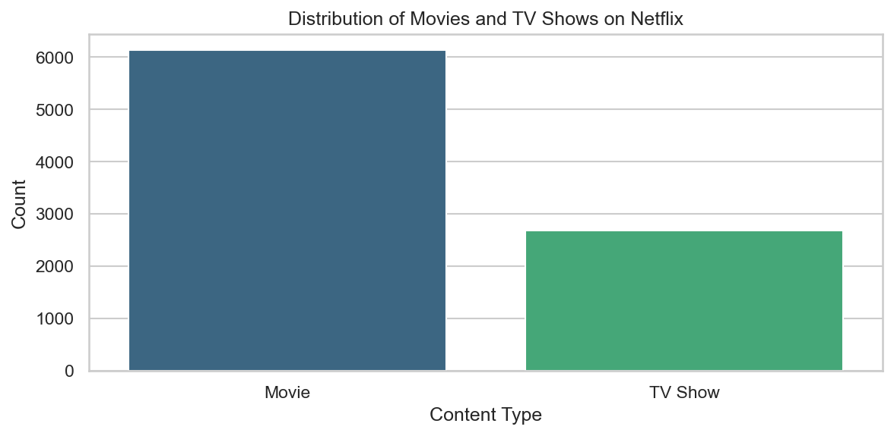
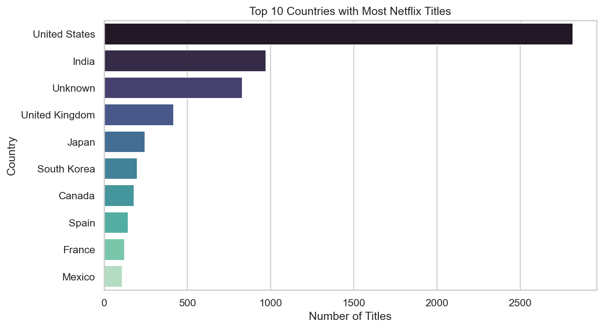

# 🎬 Netflix Data Insights Dashboard

This project explores and visualizes the Netflix Movies and TV Shows dataset from Kaggle.  
It focuses on uncovering trends in content types, countries, and release patterns to understand how Netflix's library has evolved over time.

The project demonstrates key data analysis and visualization skills using Python, Pandas, Matplotlib, and Seaborn.

---

## 📊 Dataset Information

**Source:** [Netflix Movies and TV Shows Dataset – Kaggle](https://www.kaggle.com/datasets/shivamb/netflix-shows)

The dataset contains information about all the movies and TV shows available on Netflix as of 2021.

| Column Name    | Description                                |
| -------------- | ------------------------------------------ |
| `show_id`      | Unique identifier for each title           |
| `type`         | Type of content – Movie or TV Show         |
| `title`        | Title of the content                       |
| `director`     | Name of the director                       |
| `cast`         | Main actors involved in the title          |
| `country`      | Country where the title was produced       |
| `date_added`   | Date when the title was added to Netflix   |
| `release_year` | Original release year of the title         |
| `rating`       | TV rating of the content (e.g., PG, TV-MA) |
| `duration`     | Duration of the movie or number of seasons |
| `listed_in`    | Genre(s) or category(ies) of the title     |
| `description`  | Brief summary or plot of the title         |

---

## 🧱 Project Structure

```
netflix-data-insights/
│
├── data/
│   └── netflix_titles.csv                # Dataset file
│
├── notebooks/
│   └── exploratory_analysis.ipynb        # Main analysis and visualization notebook
│
├── src/
│   ├── data_cleaning.py                  # Data preprocessing functions
│   ├── data_analysis.py                  # Summary and exploration functions
│   └── data_visualization.py             # Visualization functions
│
├── assets/                               # Saved plots
│   ├── movies_vs_tvshows.png
│   ├── top_countries.png
│   └── content_by_year.png
│
├── requirements.txt                      # Python dependencies
└── README.md                             # Project documentation
```

---

## 🧹 Data Cleaning & Preparation

The raw dataset contained several missing or inconsistent values, mainly in the `director`, `cast`, `country`, and `date_added` columns.  
The following preprocessing steps were applied:

1. **Removed duplicates** to ensure data integrity.
2. **Filled missing categorical values** (`director`, `cast`, `country`) with `"Unknown"`.
3. **Converted** the `date_added` column to a proper `datetime` format.
4. **Extracted** the `year_added` column for trend analysis.
5. Verified all data types and ensured consistency across the dataset.

These steps made the dataset clean, structured, and ready for analysis.

---

## 📈 Exploratory Data Analysis (EDA)

### Key Questions Explored

- How many **Movies vs TV Shows** are on Netflix?
- Which **countries** produce the most content?
- How has Netflix’s content **growth** changed over the years?

### Summary of Findings

1. **Movies dominate** Netflix's library, accounting for roughly 70% of all titles.
2. **The United States and India** are the top content producers, followed by the UK and Japan.
3. Netflix experienced **massive growth after 2015**, peaking around 2019–2020.

---

## 🧰 Tools & Technologies Used

| Category                 | Tools & Libraries                    |
| ------------------------ | ------------------------------------ |
| **Programming Language** | Python 3.13                          |
| **Data Analysis**        | Pandas, NumPy                        |
| **Data Visualization**   | Matplotlib, Seaborn                  |
| **Environment**          | Jupyter Notebook, VS Code            |
| **Version Control**      | Git & GitHub                         |
| **Dataset Source**       | Kaggle – Netflix Movies and TV Shows |

---

## 🚀 How to Run the Project

Follow these steps to set up and run the project on your local machine:

### 1️⃣ Clone the Repository

```bash
git clone https://github.com/<your-username>/netflix-data-insights.git
cd netflix-data-insights
```

### 2️⃣ Create and Activate a Virtual Environment

```bash
python -m venv .venv
.venv\Scripts\activate     # On Windows
source .venv/bin/activate    # On macOS/Linux
```

### 3️⃣ Install Dependencies

```bash
pip install -r requirements.txt
```

### 4️⃣ Run the Jupyter Notebook

```bash
jupyter notebook notebooks/exploratory_analysis.ipynb
```

### 5️⃣ (Optional) Run via Python Scripts

```bash
python -m src.data_cleaning
python -m src.data_analysis
python -m src.data_visualization
```

Once executed, all visualizations and insights will be generated interactively in your environment.

---

## 📊 Visual Highlights

| Insight                            | Visualization                                       |
| ---------------------------------- | --------------------------------------------------- |
| Movies vs TV Shows Distribution    |  |
| Top 10 Content-Producing Countries |           |
| Netflix Growth Over the Years      |        |

Each visualization provides a unique perspective on Netflix’s evolving global content strategy.

---

## 🧩 Summary Insights

The analysis reveals key trends in Netflix’s content evolution:

- 🎬 **Movies dominate Netflix’s catalog**, representing approximately 70% of all titles.
- 🌍 **The United States and India lead** in content production, with the UK and Japan following closely.
- ⏳ **Growth accelerated dramatically after 2015**, reflecting Netflix’s global expansion and focus on originals.
- 🔞 **Most content is rated ‘TV-MA’**, highlighting Netflix’s focus on mature audiences.
- 💡 **Data suggests Netflix adapts its catalog** strategically to regional demand and viewer behavior.

---

## 🧠 Conclusion & Future Work

This project provides a structured analysis of Netflix’s global content strategy using exploratory data analysis.  
The findings reveal a clear shift toward international expansion and mature audience targeting.

### Future Improvements:

- 📅 **Add Time-Series Forecasting:** Predict future title additions using ARIMA or Prophet models.
- 🌐 **Genre-Level Analysis:** Examine trends in genres such as Drama, Comedy, or Action.
- 📊 **Interactive Dashboard:** Build a Streamlit or Power BI dashboard for dynamic exploration.
- 🧮 **Correlation Study:** Analyze relationships between release year, rating, and duration.

This project demonstrates practical data analytics and storytelling skills — key components of a professional data portfolio.

---

## 👨‍💻 Author

**Berke Arda Türk**  
Data Science & AI Enthusiast | Computer Science (B.ASc)  
[🌐 Portfolio Website](https://berke-turk.web.app/) • [💼 LinkedIn](https://www.linkedin.com/in/berke-arda-turk/) • [🐙 GitHub](https://github.com/Mood07)
